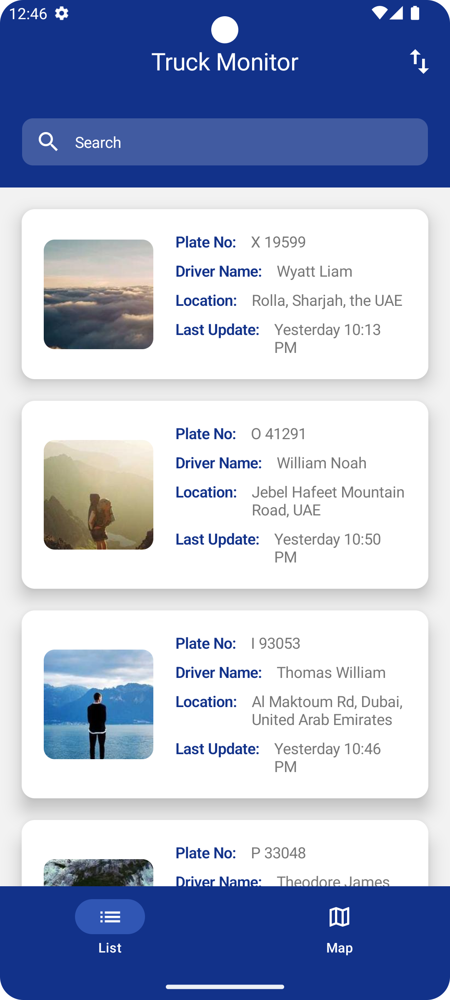
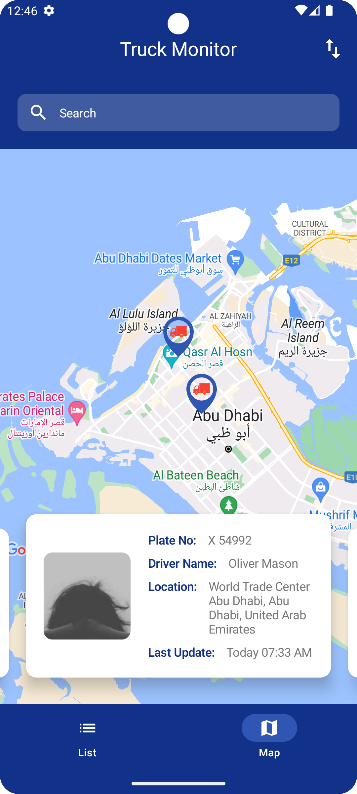

# TruckMonitor
Truck Monitor App

The Project is implemented using below tools and architecture.

Tools
  1. Android Studio Giraffe | 2022.3.1 Patch 1
  2. Android Gradle Plugin Version: 8.1.1
  3. Gradle Version: 8.0
  4. Used Version Catalog for handling library dependencies

Architecture
  1. MVVM
  2. Jetpack Compose
  3. Hilt for Dependancy Injection
  4. Retrofit for networking
  5. Gson for serialization
  6. RoomDb for local storage
  7. Coil for image loading and caching

Screens
<table>
  <tr>
     <td>Start</td>
     <td>Questionnaire List</td>
  </tr>
  <tr>
    <td></td>
    <td></td>
  </tr>
 </table>
